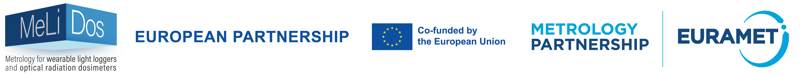

# Data and Metadata conventions

This README summarizes conventions for data and metadata in the MeLiDos project field study (WP2).

This document will be updated as needed. It was last updated on **12 March 2025**.

## Folder structure

This is the folder structure of the MeLiDos project field study (WP2). Please adhere to it when collecting and providing data:

```         
$ProjectID/
    ethics/
    code/         
    data*/
        raw/
            group/
               chronotype/
               demographics/
               discharge/
               screening/
            individual/
               $ParticipantID/
                     continuous/
                         actlumus_wrist
                         actlumus_head
                         actlumus_chest
                         currentconditions/
                         exercisediary/
                         experiencelog/
                         mHLEA_digital/
                         mHLEA_paper/
                         sleepdiary/
                         wearlog/
                         wellbeingdiary/
                     demographics/
                     discharge/
                     screening/
    participant_docs/
    materials/
        inperson_screening/
        online_screening/
        questionnaires/
```

-   Please split the files according to the folder conventions. Importantly, this gives a subfolder for each wearing position of an actlumus device.

-   Data in a single file per participant should be in the folder "individual "and not appear a second time in „group"

-   Data in one file for the whole group should be in the folder „group“ and not be split up into separate files for „individual“. See the next point.

-   Data in the group folder require a lookup table.

    -   This table has the following form (example from KNUST):

        | record_id | ID         |
        |-----------|------------|
        | 1         | KNUST_S001 |
        | 2         | KNUST_S002 |
        | 3         | KNUST_S003 |
        | ...       | ...        |

    -   Each file requires such a lookup table, because:

        -   there will be files from multiple partners/sites, each with a different ID, but identical record_id's

        -   multiple record_id's can be assigned to a single participant across files

    -   Each lookup table must have the following file name:

        -   `$file.name.of.reference.file_lookup.csv`

        -   wenn you remove the name of the file that the lookup table references, it should read `_lookup.csv`

    -   **Each partner has to create these lookup tables in this form before sending over their data, otherwise TUM will not be able assign RedCap questionnaires to participants light exposure data**
    
    -  **The lookup table must be in the same folder as the data file it references**
    
    -  An example can be found under [lookup/example_lookup.csv](https://raw.githubusercontent.com/MeLiDosProject/Data_Metadata_Conventions/main/lookup/example_lookup.csv)

## Metadata conventions

Partners initially only have to provide very little metadata. This metadata has to be provided in a file called `Metadata_Melidos_$partner.xlsx`. An empty example can be found under [metadata/Metadata_Melidos_partners.xlsx](https://raw.githubusercontent.com/MeLiDosProject/Data_Metadata_Conventions/main/metadata/Metadata_Melidos_partners.xlsx).

### Study_level:

- if your local ethics committee approved the projectwide TUM ethics approval, please provide this information in cell E2
- fill in all contributors. For contributor roles use the CRediT taxonomy

### Participant level:

- just provide the codes you assigned to your participants

### Device level:

- please assign a unique Id to your device in the form of KNUST_AL01/FUSTPCEU_AL01, _AL02, _Al03, and so on.

### Dataset level:

- use the IDs from participant level and device level to uniquely identify files. Please use one row per file
- row 17 and following (Full file names) should only contain names of files containing timestamp data, such as ActLumus files, or wearlogs. Files that contain information about a participant in general (so no time stamp attached to a row, such as chronotype or demographic inf) will be ultimately part of the participant level metadata, not the dataset.
- further, if a file contains information about more than one dataset - i.e., the questionnaires contained in the „continuous“ folder, as they refer to all three datasets of a participant (wrist, head, chest), that file should be listed in every dataset it belongs to.

## Participant naming conventions

Participants are assigned a three-digit number starting from 001 (002, 003, etc.), prefaced by „\_S“ (underscore + capital S), prefaced by the collection site (BAUA, FUSPCEU, KNUST, IZTECH, RISE, THUAS). Here are examples:

-   BAUA_S005

-   FUSPCEU_S020

-   IZTECH_S001

-   KNUST_S002

-   RISE_S014

-   THUAS_S008

## Wearing position naming conventions

Wearing positions are abbreviated in file names as follows:

-   wrist: **w**
-   head (glasses): **h**
-   chest (necklace): **c**

If you use full names, please do not use the names in brackets.
